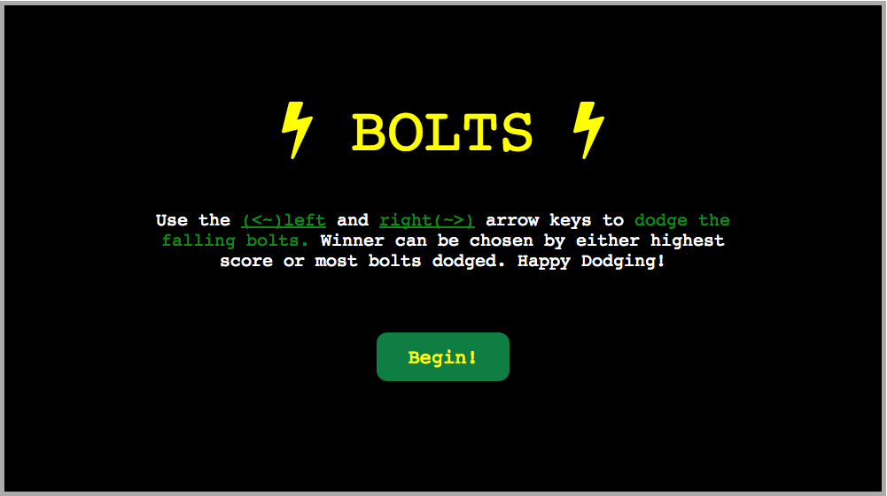
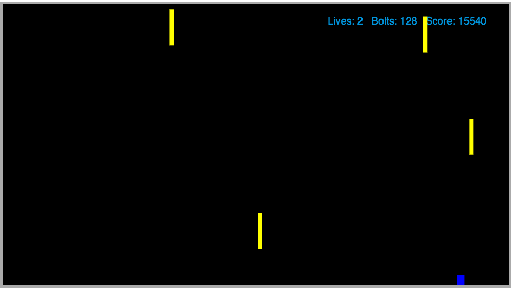

# Bolts

<i>Fun</i> <strong>Short Easy Game</strong>: [Play Here][Bolts]

Bolts are striking from the sky in a crazy storm... You are a blob of water, dodging the cascading bolts as the storm increases in intensity. Being made of water, your movements are fluid and you don't move nor stop immediately. How long will you survive this onslaught of falling electricity?

## Landing View

[][Bolts]

## Playing View

[][Bolts]

## Languages and Technologies

* Native JavaScript (Vanilla JS)
* HTML5 Canvas
* CSS3
* DOM

## Libraries

* [Keymaster](https://github.com/madrobby/keymaster)

## Features

* Collision Detection between player and falling bolts
* Algorithm to alter falling bolts' velocity mid-drop
* Player Damage and Death animation effects using setInterval
* Difficulty increases in stages using score thresholds

## GamePlay

Use the <strong>"LEFT"</strong> and <strong>"RIGHT"</strong> arrow keys on the keyboard to move your player to dodge the falling bolts. 
After you have been struck <strong>3</strong> times you... can give it try and enjoy. The player with the highest score or highest number of bolts survived is the winner.

[Bolts]: http://www.bryantcurtis.com/Bolts
